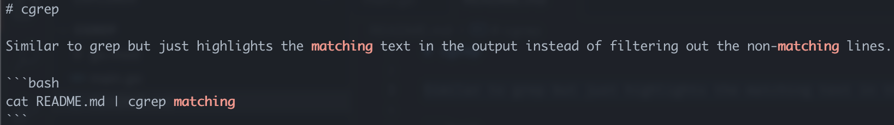

# cgrep

Similar to grep but just highlights the matching text in the output instead of filtering out the non-matching lines.

```bash
cat README.md | cgrep matching
```

Running the above will output the following:



Install with:

```bash
go install github.com/strongishllama/cgrep@latest
```
